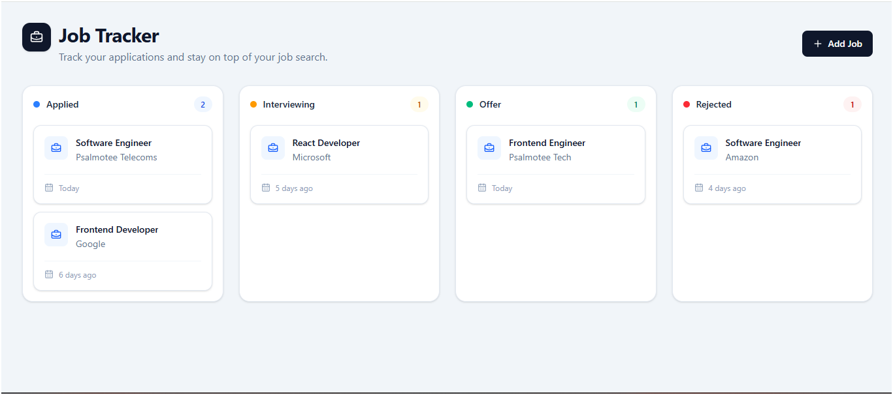
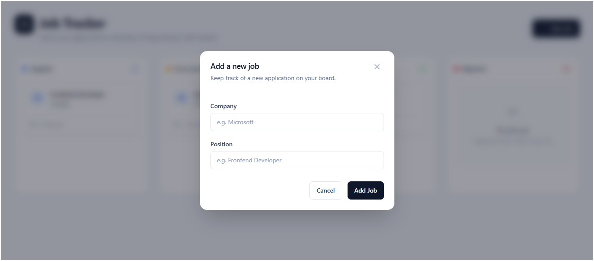
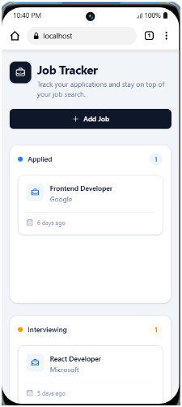

# Kanban Job Tracker

A modern, responsive Kanban-style job application tracker built with **React, TypeScript, Tailwind CSS, and DnD Kit**.

The application helps users organize job applications across different stages of the hiring process using an interactive drag-and-drop workflow.

## Overview

Traditional list-based job trackers can make it difficult to visualize where applications are within the hiring process. Kanban Job Tracker provides a visual workflow where each application can be moved between stages as its status changes.

The application currently supports four job application stages:

- Applied
- Interviewing
- Offer
- Rejected

## Screenshots

### Kanban Board



### Add Job Modal



### Mobile Board



## Application Workflow

```text
Applied → Interviewing → Offer
    ↓
 Rejected
```

Users can:

- Add new job applications
- Move applications between workflow stages
- Delete applications
- Persist application data in LocalStorage
- View a loading skeleton while persisted data is loaded
- Use the application across desktop, tablet, and mobile layouts

---

## Features

### Kanban Board

The application uses four workflow columns:

- **Applied**
- **Interviewing**
- **Offer**
- **Rejected**

Job cards can be moved between columns using drag-and-drop.

### Add Job

Users can add a new job application through a modal form.

The form includes:

- Company name
- Position
- Client-side validation
- Accessible labels and error messages
- Keyboard-friendly interaction

New applications are automatically added to the **Applied** column.

### Drag and Drop

Drag-and-drop interactions are implemented using **DnD Kit**.

The implementation supports:

- Dragging cards between columns
- Dropping onto existing cards
- Dropping into empty columns
- Visual drag state
- Column drop highlighting
- Safe handling of invalid drop targets
- Pointer-based drag activation

### Delete Jobs

Users can remove applications directly from a job card.

Deleting a job immediately updates the board and persisted LocalStorage state.

### LocalStorage Persistence

Job data is persisted in the browser using a reusable `useLocalStorage` custom hook.

The hook:

- Loads saved data from LocalStorage
- Falls back to initial data when no saved data exists
- Persists state changes automatically
- Handles LocalStorage errors safely
- Provides loading state management
- Simulates a short loading delay for the skeleton UI

### Loading Skeleton

A skeleton UI is displayed while persisted job data is being loaded.

This provides visual feedback while the application initializes its persisted state.

### Responsive UI

The board adapts to different screen sizes:

| Screen Size | Layout |
| --- | --- |
| Mobile | 1 column |
| Tablet | 2 columns |
| Desktop | 4 columns |

---

## Tech Stack

### Frontend

- React
- TypeScript
- Vite
- Tailwind CSS

### UI and Interaction

- DnD Kit
- Lucide React
- React Hook Form

### Development and Code Quality

- ESLint
- Prettier
- Husky
- lint-staged

### Data Persistence

- Browser LocalStorage
- Custom React hooks

---

## Project Structure

```text
src/
├── components/
│   ├── board/
│   │   ├── Board.tsx
│   │   ├── BoardColumn.tsx
│   │   ├── BoardSkeleton.tsx
│   │   ├── JobCard.tsx
│   │   └── index.ts
│   │
│   ├── layout/
│   │   ├── Container.tsx
│   │   ├── Header.tsx
│   │   └── index.ts
│   │
│   ├── modal/
│   │   ├── AddJobModal.tsx
│   │   └── index.ts
│   │
│   └── ui/
│       ├── Badge.tsx
│       ├── Button.tsx
│       ├── Card.tsx
│       ├── EmptyState.tsx
│       ├── Input.tsx
│       ├── Modal.tsx
│       ├── Skeleton.tsx
│       └── index.ts
│
├── constants/
│   ├── status.ts
│   ├── storage.ts
│   └── index.ts
│
├── data/
│   ├── initialJobs.ts
│   └── index.ts
│
├── hooks/
│   ├── useJobs.ts
│   └── useLocalStorage.ts
│
├── lib/
│   ├── dates.ts
│   ├── jobs.ts
│   ├── cn.ts
│   └── index.ts
│
├── types/
│   ├── job.ts
│   ├── common.ts
│   └── index.ts
│
├── App.tsx
└── main.tsx
```

---

## Architecture

The application follows a lightweight separation-of-concerns approach.

### Components

UI components are responsible for presentation and user interaction.

Examples include:

- `Board`
- `BoardColumn`
- `JobCard`
- `AddJobModal`
- `Button`
- `Input`
- `Modal`

Keeping these responsibilities inside components makes the interface easier to maintain and reuse.

### Hooks

Application state and persistence logic are separated into custom React hooks.

#### `useJobs`

`useJobs` manages job-related operations:

- Add job
- Move job
- Delete job
- Load jobs
- Persist job changes

#### `useLocalStorage`

`useLocalStorage` provides reusable browser persistence and loading state management.

It is implemented as a generic hook so it can work with different data types.

### Lib

Pure application logic is kept outside React components.

Examples include:

```ts
groupJobsByStatus()
moveJob()
addJob()
deleteJob()
formatRelativeDate()
```

This keeps components focused on rendering and user interaction.

### Types

The project uses explicit TypeScript types for application data.

For example:

```ts
interface Job {
  id: string;
  company: string;
  position: string;
  status: JobStatus;
  createdAt: number;
}
```

Application state does not rely on the `any` type.

---

## Type Safety

TypeScript strictness is an important part of the implementation.

Job statuses are represented using a literal type derived from the application's status constants:

```ts
export const JOB_STATUS = {
  APPLIED: "Applied",
  INTERVIEWING: "Interviewing",
  OFFER: "Offer",
  REJECTED: "Rejected",
} as const;

export type JobStatus =
  (typeof JOB_STATUS)[keyof typeof JOB_STATUS];
```

This prevents arbitrary strings from being assigned as job statuses.

For example:

```ts
moveJob(jobId, "Interviewing");
```

is valid because `"Interviewing"` is one of the defined `JobStatus` values.

An unknown status would produce a TypeScript compilation error.

---

## State Management

The application uses React state and custom hooks rather than introducing a global state management library.

The state flow is:

```text
useJobs
   │
   ├── jobs
   ├── addJob()
   ├── moveJob()
   └── deleteJob()
          │
          ▼
   useLocalStorage
          │
          ▼
     LocalStorage
```

This keeps the application lightweight while maintaining a clear separation between UI, application logic, and persistence.

---

## Drag and Drop Architecture

DnD Kit is used to provide the application's drag-and-drop functionality.

The implementation distinguishes between job cards and board columns using DnD Kit metadata.

### Column

```ts
data: {
  type: "column",
  status: column.id,
}
```

### Job Card

```ts
data: {
  type: "job",
  job,
}
```

This distinction allows the drag-and-drop logic to determine whether the user is interacting with a column or a job card.

The board also provides visual feedback when a card is dragged over a valid column.

---

## LocalStorage Strategy

The `useLocalStorage` hook uses a generic type parameter:

```ts
useLocalStorage<Job[]>({
  key: STORAGE_KEYS.JOBS,
  initialValue: initialJobs,
});
```

This allows the same hook to support different data types while maintaining TypeScript type safety.

The hook also supports a configurable loading delay:

```ts
delay = 1000;
```

This is used to demonstrate a loading state through the skeleton UI.

The persistence flow is:

```text
Application starts
       │
       ▼
Read LocalStorage
       │
       ├── Data found
       │      ↓
       │   Restore jobs
       │
       └── No data
              ↓
        Use initial jobs
              │
              ▼
        Render application
              │
              ▼
       Save future changes
```

---

## Getting Started

### Prerequisites

Make sure you have the following installed:

- Node.js
- npm

Verify your installation:

```bash
node --version
npm --version
```

### Installation

Clone the repository:

```bash
git clone https://github.com/Psalmotee/kanban-job-tracker.git
```

Navigate into the project:

```bash
cd kanban-job-tracker
```

Install dependencies:

```bash
npm install
```

### Start Development Server

```bash
npm run dev
```

The application will be available at the local Vite development URL shown in the terminal.

---

## Available Scripts

### Development

```bash
npm run dev
```

Starts the Vite development server.

### Production Build

```bash
npm run build
```

Runs TypeScript compilation and creates the production build.

### Lint

```bash
npm run lint
```

Checks the project for ESLint errors.

### Fix Lint Issues

```bash
npm run lint:fix
```

Automatically fixes supported ESLint issues.

### Format

```bash
npm run format
```

Formats the project using Prettier.

### Check Formatting

```bash
npm run format:check
```

Checks whether project files are correctly formatted.

### Preview Production Build

```bash
npm run preview
```

Runs the production build locally.

---

## Code Quality

The project uses several tools to maintain consistent code quality.

### ESLint

ESLint checks the TypeScript and React codebase for potential issues and coding problems.

### Prettier

Prettier maintains consistent formatting across the project.

### Husky

Husky is used to manage Git hooks.

### lint-staged

lint-staged runs linting and formatting against staged files before commits.

Together, these tools help prevent common formatting and code-quality issues from being committed.

---

## Accessibility

Accessibility considerations include:

- Semantic HTML
- Accessible form labels
- Appropriate `aria-label` attributes
- `aria-invalid` form state
- Keyboard-accessible controls
- Escape key support for the modal
- Visible focus states
- Accessible delete buttons
- Non-color-only status indicators
- Appropriate button types

The interface does not rely solely on color to communicate status or interaction state.

---

## Responsive Design

The Kanban board uses responsive breakpoints to adapt to different viewport sizes.

```text
Mobile
   ↓
1 column

Tablet
   ↓
2 columns

Desktop
   ↓
4 columns
```

This allows the application to remain usable across different screen sizes without requiring a separate mobile interface.

---

## Development Decisions

### Why DnD Kit?

DnD Kit provides a modern and extensible drag-and-drop system for React applications.

It gives the application control over:

- Drag activation
- Drop targets
- Collision detection
- Drag state
- Column interactions

This made it suitable for implementing the Kanban workflow.

### Why LocalStorage?

LocalStorage provides a simple browser-based persistence solution without requiring a backend or database.

It also makes the application easy to run and test locally.

### Why React Hook Form?

React Hook Form provides lightweight form state management and validation while keeping the form implementation simple.

### Why Custom Hooks?

Application logic such as job management and persistence is separated from presentation components to improve maintainability and reuse.

### Why TypeScript?

TypeScript provides compile-time validation for:

- Job data
- Job statuses
- Component props
- State transitions
- Function parameters

This is particularly useful for a Kanban application because job status transitions are central to the application's behavior.

---

## Future Improvements

Potential future enhancements include:

- Search and filter jobs
- Job notes
- Application URLs
- Salary information
- Interview dates
- Follow-up reminders
- Job editing
- Undo delete
- Backend persistence
- Authentication
- Multiple boards
- Analytics dashboard
- Automated unit tests
- End-to-end testing

These features are intentionally outside the current scope of the internship challenge.

---

## Project Status

**Status: Completed**

The project currently demonstrates:

- React + TypeScript
- Type-safe application state
- Drag-and-drop interactions
- React Hook Form
- LocalStorage persistence
- Custom React hooks
- Loading skeletons
- Responsive UI
- Accessible interactions
- ESLint
- Prettier
- Husky
- lint-staged

---

## Author

### Samson Tolulope Moradeyo

Frontend Developer

- GitHub: [@Psalmotee](https://github.com/Psalmotee)
- LinkedIn: [Samson Moradeyo](https://www.linkedin.com/in/samson-moradeyo-211b26187/)

---

## License

This project was created as part of a frontend development learning journey, focusing on modern React development, reusable component architecture, accessibility, responsive design, and maintainable TypeScript code.
